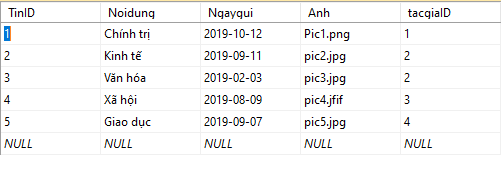
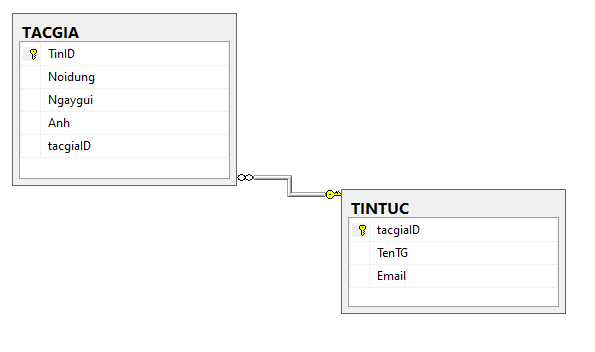
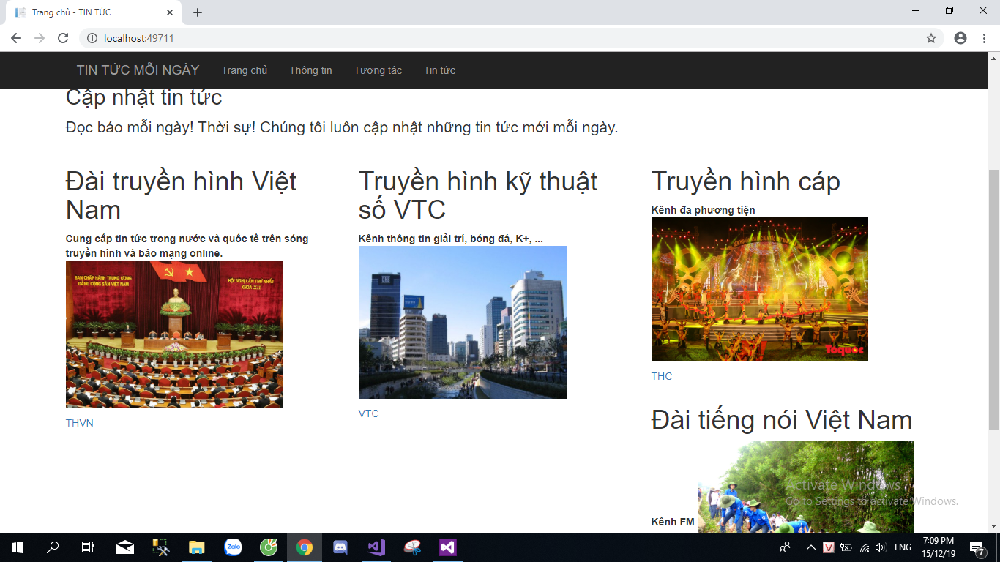

Bài thi kết thúc môn 
 
Xây dựng website thương mại
 
<h1>Cơ sở dữ liệu </h1>
 

 

 

 
<h2>Hình ảnh giao diện</h2>

 

 

<h3>Liên kết với một số báo trang web khác phần chữ nhỏ dưới hình ảnh</h3>
 

